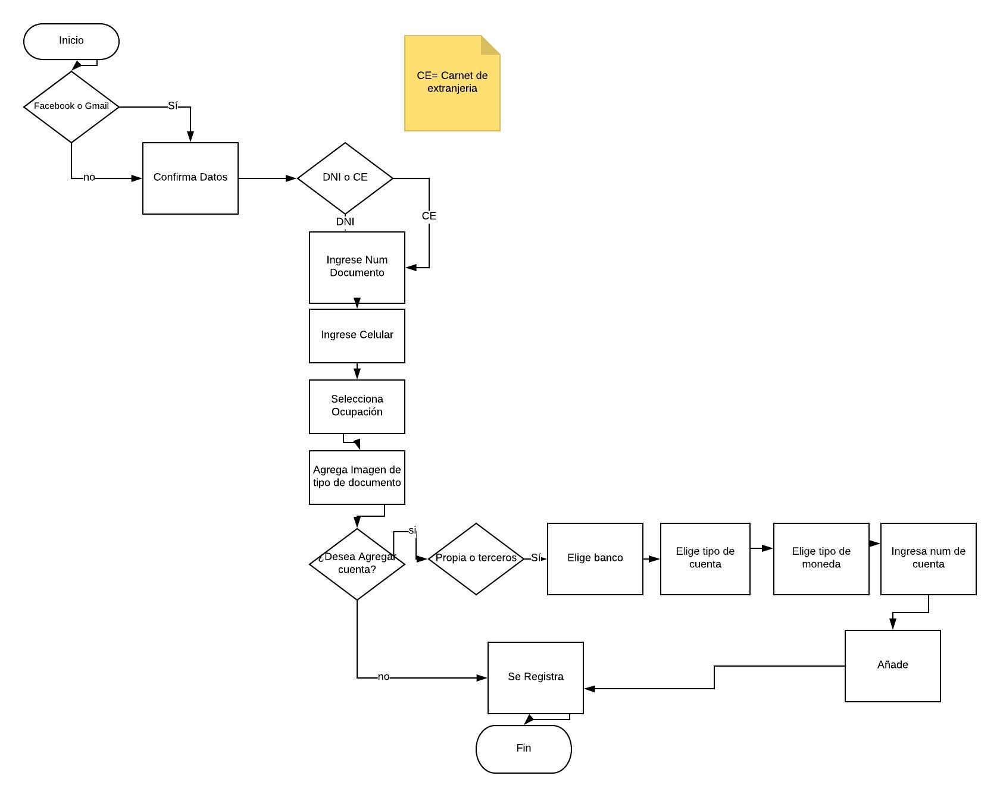
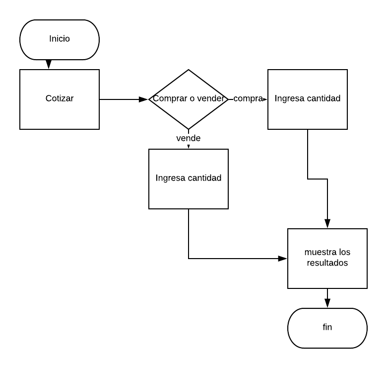
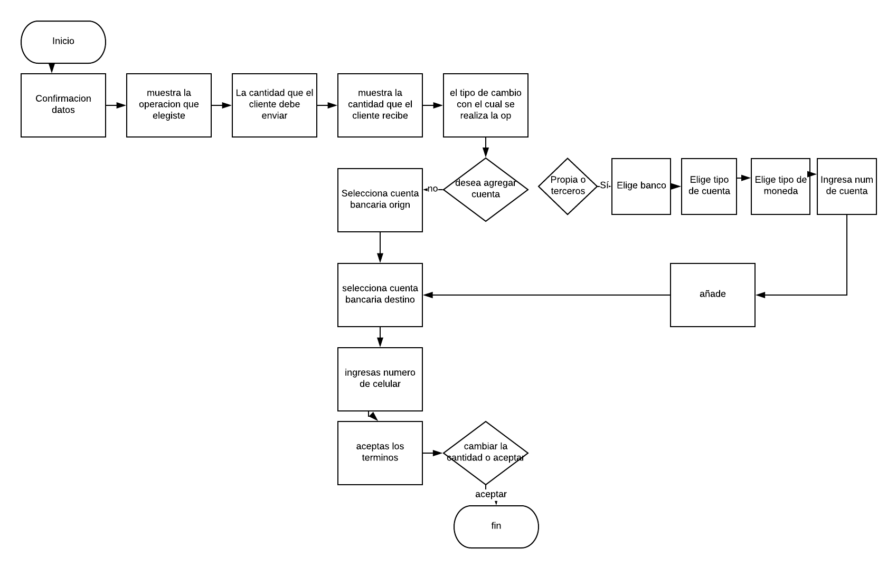
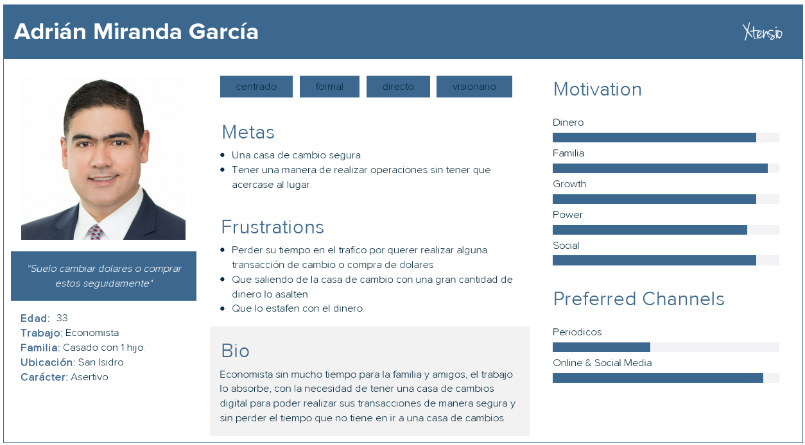
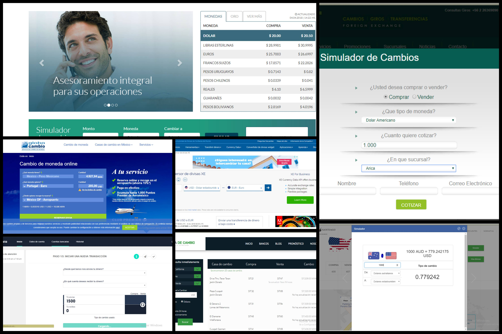
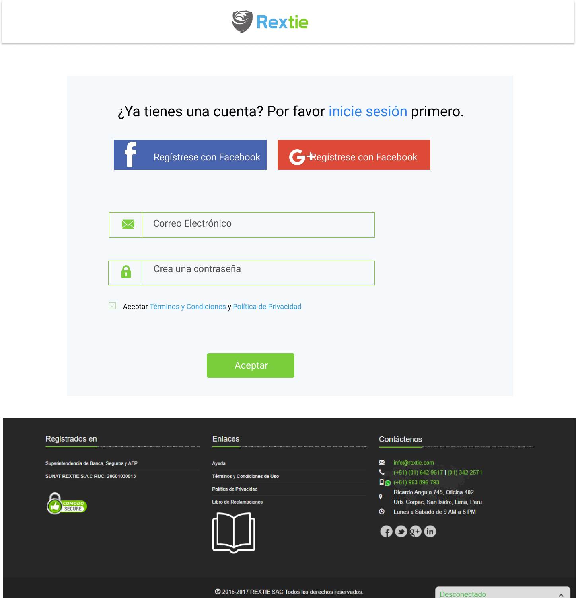
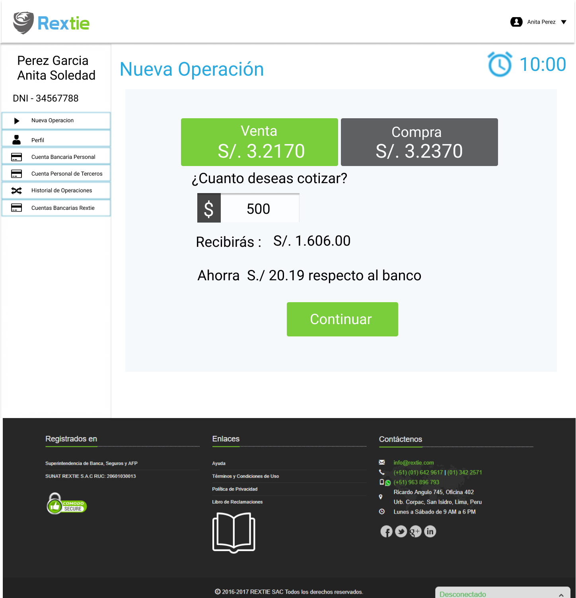
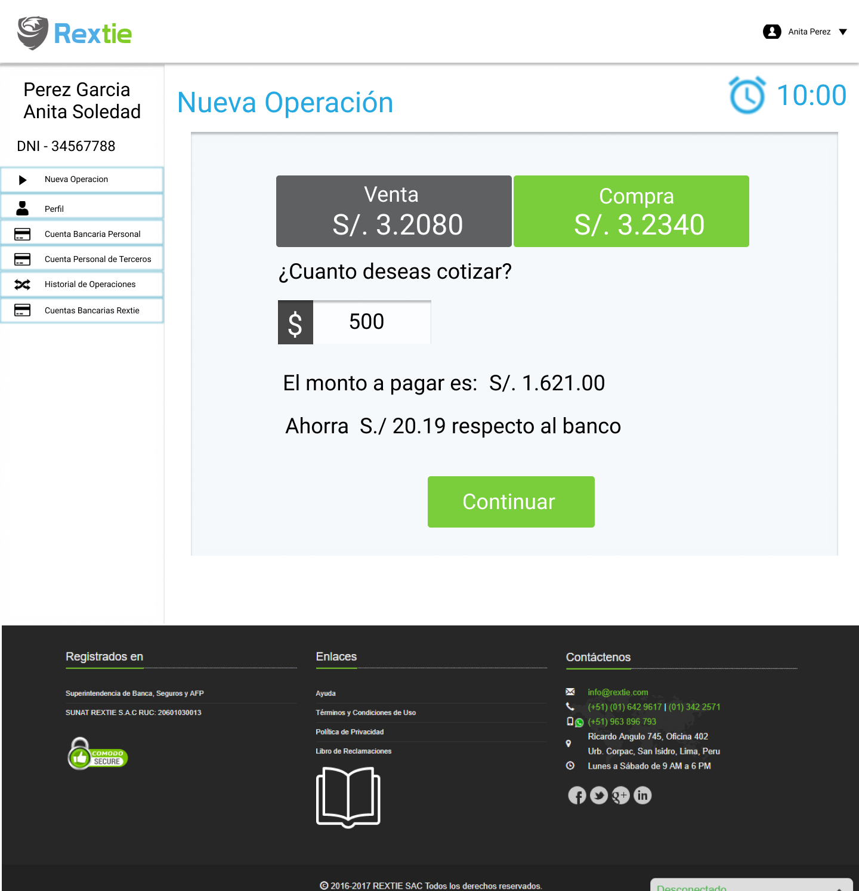
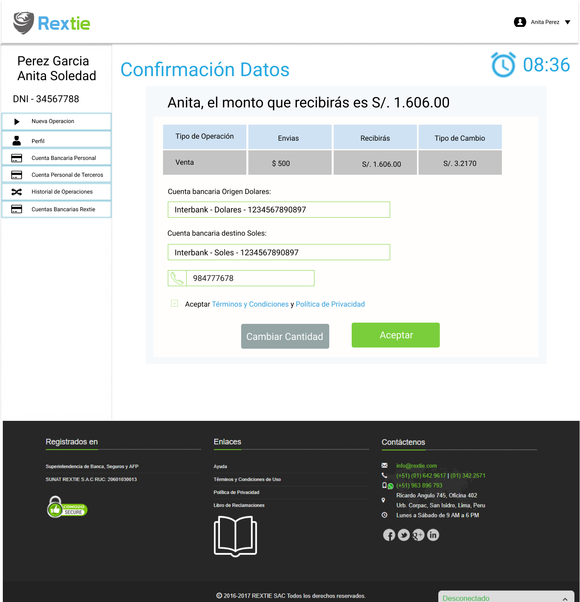
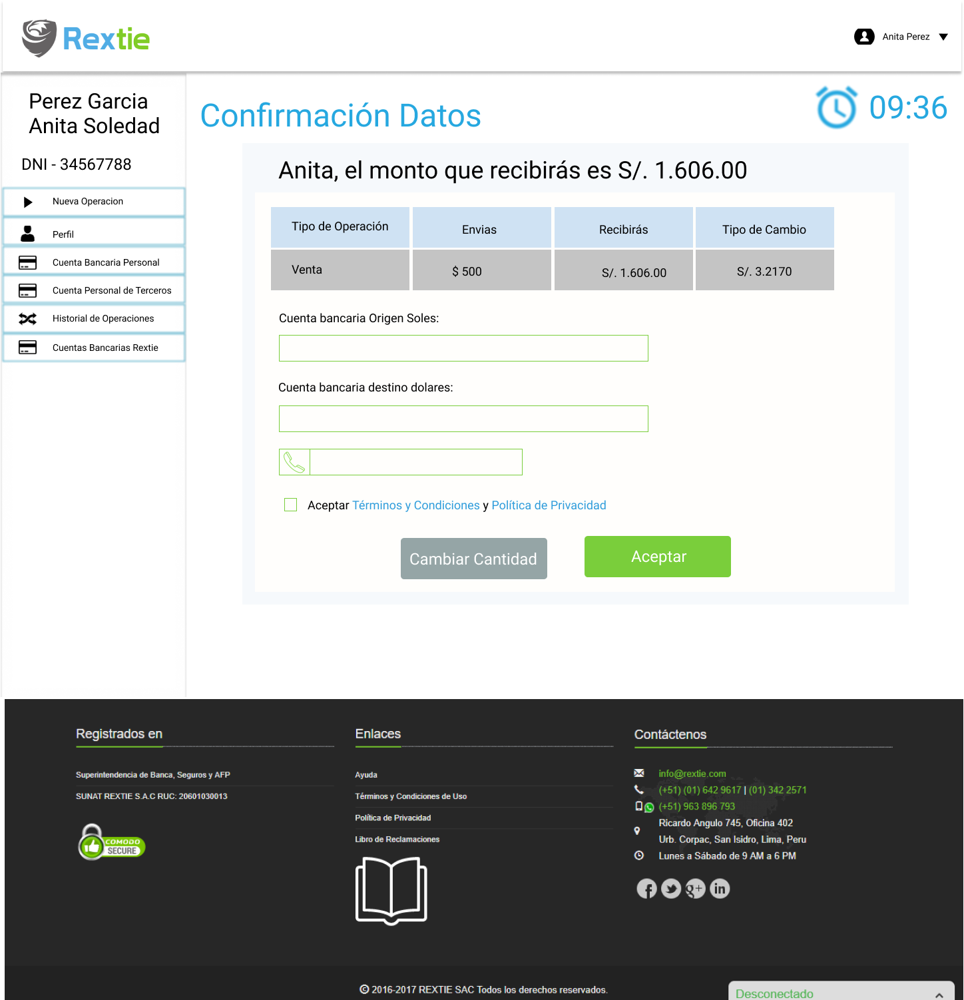

# Rextie
Acerca de Rextie, es un servicio de cambio de dólares por internet 100% digital registrado
Como casa de cambio en la Superintendencia de Banca, Seguros y AFP (SBS). 

#### Requerimientos:
Proponer un nuevo diseño de la aplicación web (zona privada) que facilite a los
usuarios realizar una cotización y operación de cambio de dólares.  

#### Alcance
Rextie esta dirigido a personas, pequeñas y medianas empresas.

## RESEARCH  

### Entrevistas
A los usuarios se les pidió que utilicen la pagina web de Rextie para saber en que momento se les dificultaba el proceso.

**Usuario 1- Lesly**
- El proceso de registro me fue entendible.
- al momento de realizar la cotizacion no sabia que era el signo del dolar de al lado.
- al colocar el monto no entendia si era soles o dolares

**Usuario 2- Patricia**
- Vi que tenía una un tiempo de vencimiento pero al pasarme de la hora no sucedia nada (lo probó fin de semana)
- El signo de dolar, no sabia que era un botón.

**Usuario 3- Ambar**
- El registro bien.
- No entendi la utilidad de el boton, no parecía un boton.
- luego de confirmar los datos no sabía que seguía.

**Usuario 4- Romina**
- Me registre bien.
- Quise cotizar pero yo ponía tengo y no entendía el quiero.
- Quise volver a ver el mensaje final y no pude.

## Affinity Map
Al analizar la data mediante encuestas descubrimos que en su totalidad que el grupo que encuestamos via web ninguno conocía REXTIE y que ellos veian que era más facil realizar sus operaciones en la calles o bancos.

- Luego de las entrevistas encontramos lo siguiente:


### Análisis del flujo 
Aqui mostraremos el flujo de los procesos:

**Registro**
-   

**Cotizacion**
- 

**Confirmacion de datos**
- 
  

### User Personas  
Se creo un user persona ideal para la pagina web de la empresa.  



### Benchmarking
Elegimos 7 empresa para analizar, y estas son: 
- Afex
- Casa de cambio
- Cambio Santiago
- Kambista
- Globo Cambio
- Alpe
- XE


### Prototipo






### Demo
[marvel](https://marvelapp.com/44399a8/screen/40704920)


## **Herramientas Tecnológicas**

* HTML 5

* CSS 3

* Framework Bootstrap

* React

* Babel

* Node.js

* Guía de Estilos(`.eslintrc`)

## **Getting Started**

### **Estructura de Carpetas**

```bash
Proyecto
├── public/
│   ├── index.html
│
├── src/
│   ├── components
│       ├── menu/
│       │   ├── Navbar.jsx
│       ├── operations/
│       │   ├── AllOperations.jsx
│       │   ├── Main.jsx
│       │   ├── NewOperation.jsx
│       │   ├── OperatingHistory.jsx
│       │   ├── PersonalBankAccount.jsx
│       │   ├── PersonalInformaton.jsx
│       │   ├── RextieBanking.jsx
│       │   ├── ThirdPartyBankAccount.jsx
│       ├── changeBox/
│       │   ├── ChangeOfDolars.jsx
│       │   ├── ChangeOperation.jsx
│       │   ├── Messages.jsx
│       ├── confirmationData/
│       │   ├── InformationData.jsx
│       │   ├── ModalBankAccount.jsx
│       ├── transfer/
│       │   ├── mainTransfer.jsx
│       │   ├── RextieTransferToClient.jsx
│       │   ├── TransferYourOnlineBank.jsx
│       ├── app.js
│       ├── Welcome.js
│
├── .gitignore
│
├── package.json
│
├── README.md 
│
├── yarn.lock

